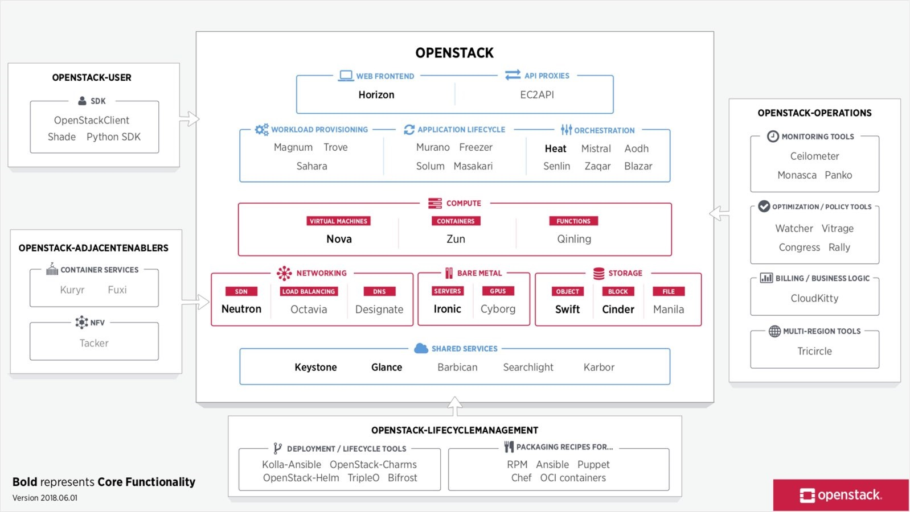
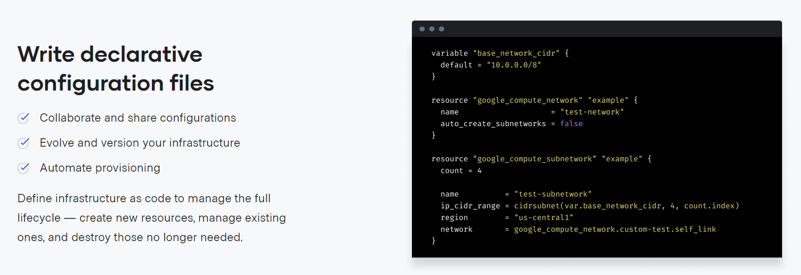
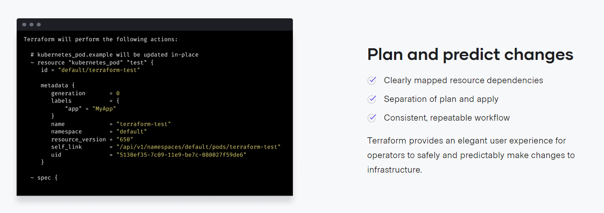
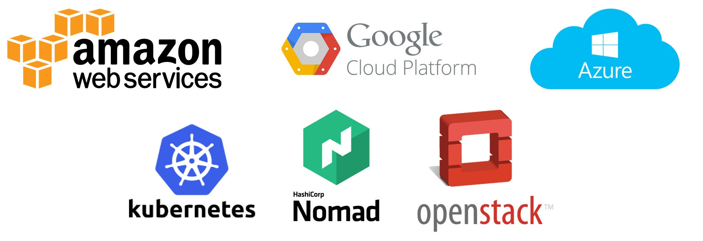
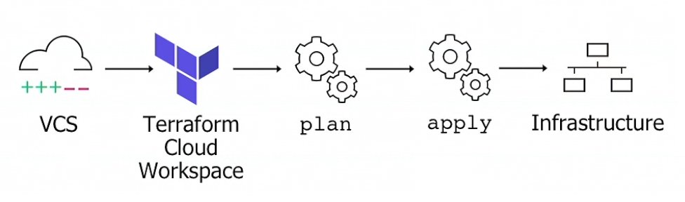

# Terraform on OpenStack at home

---

**Hein quoi ?!**

*Terraform* ? Un des nombreux outils/frameworks d'Infrastructure-As-Code utilisé pour consommer du cloud (mais pas que).

*OpenStack* ? Une plateforme de cloud computing open source.

Notes:
- Mentionner "pourquoi ?" cette présentation.
- [GitOps](https://www.weave.works/technologies/gitops/).

----

## Le cloud en 2 minutes

----

#### Le cloud c'est ...

- *On-demand self-service*
- *Broad network access*
- *Resource pooling* (e donc *Multi-tenancy*)
- *Rapid elasticity*
- *Measured Service*

... le tout via de l'automatisation.

Notes:
- *Cloud computing is a model for enabling convenient, on-demand network access to a shared pool of configurable computing resources (e.g., networks, servers, storage, applications, and services)*.

----

👨‍⚖️ Pourquoi faire ?

👨‍💻 "*The Cloud Computing model offers the promise of massive cost savings combined with increased IT agility*" d'après le [NIST Cloud Computing Program](https://www.nist.gov/programs-projects/nist-cloud-computing-program-nccp).

👨‍⚖️ Génial, ne m'en dis pas plus ! On test quand ? Tu veux combien ?!

----

Plusieurs modèles de cloud

*IaaS*, *PaaS*, *SaaS*, *MaaS*, *CaaS*, *KaaS*, *DBaaS*, ..., *XaaS*.

----

Et plusieurs modèles de **déploiement** du cloud

- *Privé* - Chez moi.
- *Public* - En dehors de chez moi.
- *Hybride* - Les workloads sont exécutés/orchestrés entre au moins deux clouds.
- *Communautaire*, ...

Notes:
- ["What is hybrid cloud?"@Red Hat](https://www.redhat.com/en/topics/cloud-computing/what-is-hybrid-cloud).

---

Introduction à

## OpenStack

*Programmable infrastructure*

----

### Get started!

----

OpenStack expose un ensemble d'API pour automatiser tous les services d'infrastructure informatiques à travers un management unifié ...

----

*Les principaux services* 

----

En général, une installation "core" comporte *Nova*, *Neutron*, *Glance*, *Keystone*, *Cinder* et *Swift*.

----

*Architecture conceptuelle*

----

*Architecture logique*

----

Plusieurs types de typologie de déploiement : All-In-One (testing/migration), sans noeud dédié pour stockage/réseau/..., orienté NFV, ...

Ces différentes typologies de déploiement sous-tendent différentes configurations hardware/service/...

----

Les principales méthodes de déploiement sont :

- Sans gestion de configuration - Ou "Bonne chance pour les upgrades".
- **TripleO** - Un *undercloud* hébergeant un *overcloud* exposé aux end-users.
- **Kolla** - Images `containerd`/Docker des briques d'OpenStack.
  - **Kolla-Ansible** - Les playbooks Ansible permettant un déploiement des images sous Docker.
- **OpenStack-Helm** - OpenStack sur Kubernetes via Helm.

----

Un setup classique de production pourrait ressembler à ceci ...

----

*Un exemple de prérequis matériel*

----

*Les services sur les bons noeuds !*

---

Introduction à

## Terraform

----

"Use a <u>declarative</u> language (HCL) to provision and manage any cloud, infrastructure, or service [...]"

----

----

----

[*Terraform propose pléthore de provider*](https://www.terraform.io/docs/providers/index.html)

*Un provider expose des ressources propres au cloud provider qu'il supporte*

----

---

[Provisioning avec Terraform](https://github.com/le-garff-yoann/terraform-openstack-examples)

### en pratique et en détail

sur un déploiement All-In-One d'OpenStack réalisé avec [Vagrant + Kolla-Ansible](https://github.com/le-garff-yoann/vagrant-kolla-aio).

----

*Vue vulgarisée du déploiement All-In-One*

Notes:
- [OpenStack Provider networks](https://docs.openstack.org/ocata//install-guide-ubuntu/launch-instance-networks-provider.html).
- [OpenStack Self-service networks](https://docs.openstack.org/ocata//install-guide-ubuntu/launch-instance-networks-selfservice.html).

---

## Ressources

----

- [GitOps](https://www.weave.works/technologies/gitops/).
- [Documentation OpenStack](https://docs.openstack.org/train/).
- [OpenStack Networking](https://www.slideshare.net/janghoonsim/open-stack-networking-juno-l3-ha-dvr).
- [Kolla-Ansible](https://github.com/openstack/kolla-ansible).
- [le-garff-yoann/vagrant-kolla-aio](https://github.com/le-garff-yoann/vagrant-kolla-aio).
- [le-garff-yoann/terraform-openstack-examples](https://github.com/le-garff-yoann/terraform-openstack-examples).
- [Liste des providers Terraform](https://www.terraform.io/docs/providers).